# MetaSOP 🌊

[](https://opensource.org/licenses/MIT)
[](https://www.typescriptlang.org/)
[](https://nextjs.org/)
[](#)
[](http://makeapullrequest.com)
[](https://github.com/josephsenior/Metasop/stargazers)
[](https://github.com/josephsenior/Metasop/network/members)

<div align="center">

**MetaSOP** is a high-fidelity, multi-agent orchestration platform designed to automate the end-to-end software development lifecycle. By coordinating specialized AI agents—Product Managers, Architects, Engineers, Security Experts, and DevOps—MetaSOP generates synchronized, production-ready system designs and implementation plans from simple natural language requests.

[⚡ Quick Start](#-quick-start) • [📚 Documentation](#-documentation) • [🤝 Contributing](#-contributing) • [💬 Community](#-community) • [⭐ Star us on GitHub](https://github.com/josephsenior/Metasop)

</div>

---

## 🌟 Why MetaSOP?

Building software today requires coordinating multiple specialized roles, each with their own expertise and tools. MetaSOP automates this entire process by:

- **Eliminating manual coordination** between PMs, Architects, Engineers, Security, DevOps, and QA
- **Ensuring consistency** across all artifacts through cascading refinement
- **Reducing development time** from weeks to hours
- **Providing production-ready outputs** validated against industry standards

---

##  Key Features

- **Cascading Refinement**: Industry-leading "ripple" update system. When requirements change at the PM level, the platform automatically propagates those changes through the entire artifact chain (Architect -> Engineer -> Security -> QA).
- **Context-Aware Agents**: Each agent operates with deep awareness of upstream dependencies, ensuring architectural decisions are consistent across the stack.
- **LLM-Native Caching**: Leverages advanced Gemini context caching to minimize latency and token consumption during iterative refinement cycles.
- **Structured Validation**: All agent outputs are validated against strict Zod schemas and JSON structures, ensuring reliable, machine-readable artifacts.
- **Agent-to-Agent (A2A) Communication**: Specialized protocol for inter-agent delegation and task management.
- **Guest Support**: Limited diagram generation for non-authenticated users with session tracking.
- **Multi-Provider Support**: Built-in adapters for Google Gemini, Vercel AI SDK, and Token Factory (Llama 3.1).

## 🏗️ Architecture

MetaSOP utilizes a sequential pipeline with feedback loops:

1.  **Product Manager**: Defines user stories and acceptance criteria.
2.  **Architect**: Generates API contracts, database schemas, and ADRs.
3.  **Security Architecture**: Performs threat modeling and defines security controls.
4.  **DevOps Infrastructure**: Designs CI/CD pipelines and cloud infrastructure (Terraform/K8s).
5.  **Engineer Implementation**: Drafts file structures and technical implementation plans.
6.  **UI Designer**: Generates design tokens and component hierarchies.
7.  **QA Verification**: Creates comprehensive test strategies and test cases.

## 🛠️ Getting Started

### ⚡ Quick Start

Get MetaSOP up and running in under 5 minutes:

```bash
# Clone the repository
git clone https://github.com/josephsenior/Metasop.git
cd Metasop

# Install dependencies
npm install

# Set up environment variables
cp .env.example .env.local
# Edit .env.local and add your Gemini API key

# Run the development server
npm run dev

# Open http://localhost:3000
```

### Prerequisites

- **Node.js** 18+ ([Download](https://nodejs.org/))
- **npm**, **pnpm**, or **yarn** package manager
- **Gemini API Key** ([Get one here](https://ai.google.dev/))
- **Git** for version control

### Configuration

Create a `.env.local` file in the root directory:

```env
# Required: Gemini API Key
GOOGLE_AI_API_KEY=your_gemini_api_key_here

# Optional: LLM Provider (default: gemini)
METASOP_LLM_PROVIDER=gemini

# Optional: Model Selection (default: gemini-3-flash-preview)
METASOP_LLM_MODEL=gemini-1.5-pro-latest

# Optional: Agent Timeout in milliseconds (default: 180000)
METASOP_AGENT_TIMEOUT=180000

# Optional: Agent Retries (default: 0)
METASOP_AGENT_RETRIES=0
```

### Running Orchestration

```bash
# Run a test orchestration
npx tsx scripts/test_cascading_refinement.ts

# Run with custom configuration
METASOP_LLM_MODEL=gemini-1.5-pro npx tsx scripts/test_cascading_refinement.ts
```

### Development

```bash
# Start development server
npm run dev

# Type checking
npm run type-check

# Linting
npm run lint
npm run lint:fix

# Build for production
npm run build
npm run start
```

### Testing

The project uses [Vitest](https://vitest.dev/) for unit tests. The suite covers the MetaSOP pipeline: orchestrator, agents, services, adapters, and utilities.

```bash
pnpm test              # Run unit tests once
pnpm test:watch        # Run tests in watch mode
pnpm test:coverage     # Run tests with coverage report (lib/, components/, app/api/)
pnpm test:ui           # Open Vitest UI
```

Integration tests under `tests/integration/` are excluded from the default run and can be executed separately. Coverage reports are written to `./coverage` (HTML, LCOV, text).

If `pnpm test` fails with **spawn EPERM** in Cursor's terminal (common on Windows), see [Tests: spawn EPERM](docs/TROUBLESHOOTING.md#tests-spawn-eperm-in-cursor-terminal).

---

## 📚 Documentation

- **[Documentation Hub](docs/index.md)** - Complete documentation index and navigation
- [Architecture Overview](docs/ARCHITECTURE.md) - Deep dive into the system architecture
- [API Reference](docs/API.md) - Complete API documentation with examples
- [Deployment Guide](docs/DEPLOYMENT.md) - Deploy to production (Vercel, Docker, VPS)
- [Contributing Guide](CONTRIBUTING.md) - How to contribute to MetaSOP
- [Troubleshooting](docs/TROUBLESHOOTING.md) - Common issues and solutions

---

## 🏗️ Architecture

MetaSOP utilizes a sequential pipeline with feedback loops:



```mermaid
graph TD
    A[User Request] --> B[Product Manager]
    B --> C[Architect]
    C --> D[Security Architecture]
    C --> E[DevOps Infrastructure]
    C --> F[Engineer Implementation]
    C --> G[UI Designer]
    D --> H[QA Verification]
    E --> H
    F --> H
    G --> H
    
    I[Knowledge Graph] -.-> B
    I -.-> C
    I -.-> D
    I -.-> E
    I -.-> F
    I -.-> G
    I -.-> H
    
    J[Refinement Planner] -.-> I
    K[Execution Service] -.-> B
    K -.-> C
    K -.-> D
    K -.-> E
    K -.-> F
    K -.-> G
    K -.-> H
```

### Agent Pipeline

1.  **Product Manager**: Defines user stories and acceptance criteria.
2.  **Architect**: Generates API contracts, database schemas, and ADRs.
3.  **Security Architecture**: Performs threat modeling and defines security controls.
4.  **DevOps Infrastructure**: Designs CI/CD pipelines and cloud infrastructure (Terraform/K8s).
5.  **Engineer Implementation**: Drafts file structures and technical implementation plans.
6.  **UI Designer**: Generates design tokens and component hierarchies.
7.  **QA Verification**: Creates comprehensive test strategies and test cases.

### Key Components

- **Orchestrator**: Coordinates agent execution and manages the workflow
- **Knowledge Graph**: Tracks dependencies between artifacts
- **Refinement Planner**: Plans surgical updates based on user intent
- **Execution Service**: Handles timeouts, retries, and error handling
- **A2A Protocol**: Enables agent-to-agent communication

---

## 🤝 Contributing

We love contributions! Whether you're fixing a bug, adding a feature, or improving documentation, we want your help.

### How to Contribute

1. **Fork the repository** and create your branch (`git checkout -b feature/amazing-feature`)
2. **Make your changes** and ensure tests pass (`pnpm test`)
3. **Commit your changes** (`git commit -m 'Add some amazing feature'`)
4. **Push to the branch** (`git push origin feature/amazing-feature`)
5. **Open a Pull Request**

For detailed guidelines, see [CONTRIBUTING.md](CONTRIBUTING.md).

### Development Setup

```bash
# Fork and clone the repository
git clone https://github.com/YOUR_USERNAME/Metasop.git
cd Metasop

# Install dependencies
npm install

# Create a feature branch
git checkout -b feature/my-feature

# Make your changes and test
pnpm test
npm run type-check
npm run lint

# Commit and push
git add .
git commit -m "feat: add my feature"
git push origin feature/my-feature
```

---

## 💬 Community

- **GitHub Discussions**: [Join the conversation](https://github.com/josephsenior/Metasop/discussions)
- **Discord Server**: [Join our Discord](https://discord.gg/metasop) (coming soon)
- **Twitter/X**: Follow [@MetaSOP_AI](https://twitter.com/MetaSOP_AI) for updates
- **Blog**: Read our [latest posts](https://blog.metasop.dev) (coming soon)

### Getting Help

- 📖 Check the [Documentation](docs/)
- 🐛 Report bugs on [GitHub Issues](https://github.com/josephsenior/Metasop/issues)
- 💡 Ask questions on [GitHub Discussions](https://github.com/josephsenior/Metasop/discussions)
- 💬 Join our [Discord community](https://discord.gg/metasop)

---

## 🗺️ Roadmap

- [x] Multi-agent orchestration system
- [x] Cascading refinement
- [x] Knowledge graph for dependency tracking
- [x] Agent-to-agent communication protocol
- [x] Web interface with Next.js
- [ ] Additional LLM providers (OpenAI, Anthropic, etc.)
- [ ] Streaming responses for real-time updates
- [ ] Custom agent templates marketplace
- [ ] Advanced analytics and insights
- [ ] Mobile app
- [ ] Enterprise features (SSO, audit logs, etc.)

See [ROADMAP.md](ROADMAP.md) for detailed plans.

---

## 🌟 Sponsors

Support MetaSOP's development by becoming a sponsor! Your support helps us:

- Maintain and improve the core platform
- Add new features and integrations
- Provide better documentation and support
- Keep the project free and open source

[](https://github.com/sponsors/josephsenior)

---

## 📜 License

Distributed under the MIT License. See [`LICENSE`](LICENSE) for more information.

---

## 🙏 Acknowledgments

- Built with [Next.js](https://nextjs.org/)
- Powered by [Google Gemini](https://ai.google.dev/)
- UI components from [Radix UI](https://www.radix-ui.com/)
- Styled with [Tailwind CSS](https://tailwindcss.com/)
- Testing with [Vitest](https://vitest.dev/)

---

<div align="center">

**Built with ❤️ by the MetaSOP community**

[⭐ Star us on GitHub](https://github.com/josephsenior/Metasop) • [🐛 Report a Bug](https://github.com/josephsenior/Metasop/issues) • [💡 Request a Feature](https://github.com/josephsenior/Metasop/issues)

*Automating the future of engineering*

</div>
